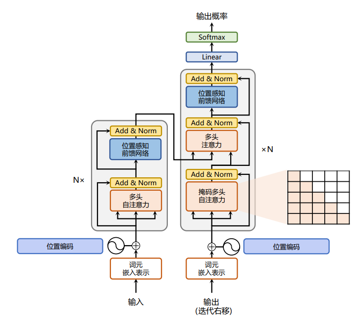
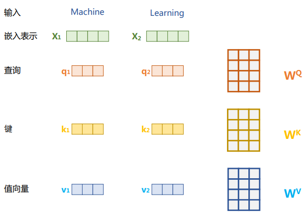

# TransformerEN2CN

Translate English to Chinese using Transformer.

使用Transformer模型完成英文翻译为中文任务。

- [TransformerEN2CN](#transformeren2cn)
  - [Dataset](#dataset)
  - [Transformer](#transformer)
    - [数据处理](#数据处理)
    - [Input Embedding](#input-embedding)
    - [注意力层](#注意力层)

## Dataset

cmn数据集：中英文预料，https://www.manythings.org/anki/

格式：英文 + TAB + 中文 + TAB + Attribution描述

数据量：24360条中英文对

```shell
Hi.	嗨。	CC-BY 2.0 (France) Attribution: tatoeba.org #538123 (CM) & #891077 (Martha)
Hi.	你好。	CC-BY 2.0 (France) Attribution: tatoeba.org #538123 (CM) & #4857568 (musclegirlxyp)
Run.	你用跑的。	CC-BY 2.0 (France) Attribution: tatoeba.org #4008918 (JSakuragi) & #3748344 (egg0073)
...
```

## Transformer

Transformer由编码器和解码器构成，其中核心部分是attention。

- 注意力层：核心是multi-head attnetion，整合上下文语义信息
- 前馈层：进行更复杂的非线性变换 $$FFN(x) = Relu(xW_1 + b_1)W_2 + b_2$$
- 残差链接： $$x = x + module(x)$$
- layer norm： $$LN(x) = \alpha \frac{x - mean}{std} + \beta$$



在实际任务实现中，要重点关注的是数据处理、position embedding和attention机制，也是下面重点分析的。

### 数据处理

本例中的数据比较干净，主要的数据处理过程为构建torch Dataset和dataloader的打batch过程。

首先是读取文件，构建Dataset，将数据打包成json的格式：

```json
{
    {"english": "Hi.", "chinese": "嗨。"},
    {"english": "Hi.", "chinese": "你好。"},
    {"english": "Run.", "chinese": "你用跑的。"},
    ...
}
```

Dataset核心是len和getitem，需要重写父类方法：

```python
class CMNDataset(Dataset):

    def __init__(self, data_file=None, max_dataset_size=10000):
        assert data_file != None
        self.max_dataset_size = max_dataset_size
        self.data = self.load_data(data_file)

    def load_data(self, data_file):
        Data = {}
        with open(data_file, "rt") as f:
            for idx, line in enumerate(f):
                if idx >= self.max_dataset_size:
                    break
                en, cn, attribute = line.split("\t")
                cn = "<bos>" + cn
                Data[idx] = {"english": en, "chinese": cn}
        return Data

    def __len__(self):
        return len(self.data)

    def __getitem__(self, idx):
        return self.data[idx]
```

Dataloader打batch过程，我们使用transformer库的tokenizer，完成目标语言和源语言的tokenize，同时按照当前batch的最大长度进行padding。同时获取padding后的src_mask和target_mask，用于在计算attention是mask掉padding token，让它们不加入attention value的计算。

```python
def collote_fn(batch_samples):
    batch_inputs, batch_targets = [], []
    for sample in batch_samples:
        batch_inputs.append(sample["english"])
        batch_targets.append(sample["chinese"])
    batch_data = tokenizer(
        batch_inputs,
        padding=True,
        max_length=max_input_length,
        truncation=True,
        return_tensors="pt",
    )
    with tokenizer.as_target_tokenizer():
        labels = tokenizer(
            batch_targets,
            padding=True,
            max_length=max_target_length,
            truncation=True,
            return_tensors="pt",
        )
        batch_data["labels"] = labels["input_ids"]
        batch_data["tgt_mask"] = labels["attention_mask"]
    return batch_data
```

### Input Embedding

Transformer模块中，对于输入的文本序列，通过一个Input Embedding层转换为对应的token序列。

token序列是通过一个简单的`nn.Embedding`词嵌入模块获得的，每个token被映射为一个可学习的、固定维度的词向量$v_t$。同时，因为单纯的词向量无法识别序列中元素顺序和相对位置，所以引入了位置编码，来表征token序列中每个token的位置信息，位置向量表示为$p_t$。Transformer的位置编采用的是正余弦函数如下：

$$
PE_{(pos, 2i)} = sin(\frac{pos}{10000^{\frac{2i}{d_{model}}}})
$$

$$
PE_{(pos, 2i+1)} = cos(\frac{pos}{10000^{\frac{2i}{d_{model}}}})
$$

- pos：表示绝对位置的index
- 2i和2i+1：表示embedding维度上的index
- d_model：表示embedding维度的值

最终Input Embedding层的输出为每个token的词向量和位置向量直接相加，生成出最终的token序列：

$$
X = [x_1, x_2, ..., x_T]
$$

$$
x_t = v_t + p_t
$$

```python
class TransformerInput(nn.Module):

    def __init__(self, config):
        super().__init__()
        self.token_embedding = nn.Embedding(config.vocab_size, config.d_model)

        # 按照最长的输入长度初始化位置编码矩阵，[max_seq_len, d_model]
        self.position_embedding = torch.zeros(config.max_seq_len, config.d_model).to(
            "cuda"
        )
        position = torch.arange(0, config.max_seq_len)
        # 增加embedding维度
        position = position.unsqueeze(1)

        i = torch.arange(0, config.d_model // 2, 1)
        div = 10000 ** (2 * i / config.d_model)
        # [max_seq_len, d_model // 2]
        term = position / div
        # embedding的偶数位置是sin
        self.position_embedding[:, 0::2] = torch.sin(term)
        # embedding的奇数位置是cos
        self.position_embedding[:, 1::2] = torch.cos(term)
        # 注册为buffer，不参与训练
        self.register_buffer("pe", self.position_embedding)

    def forward(self, x):
        # x: [batch_size, seq_len]
        # [batch_size, seq_len, d_model] + [seq_len, d_model]
        return self.token_embedding(x) + self.position_embedding[: x.size(1), :]
```

### 注意力层

attention是Transformer系列模型的核心模块，在Encoder和Decoder中都有使用，被用于建模源语言、目标语言内部和之间的任意两个token的依赖关系。在Transformer中共有三种不同的attention模块：

1. multi-head self-attention：encoder中
2. masked multi-head self-attention：decoder中
3. cross multi-head attention：decoder中

attention机制由三个元素的计算构成：q (query)、k (key)、q (value)。这个三个元素是通过三个线性变换得到的，分别依赖三个权重矩阵： $W^Q \in R^{d \times d_k}$、 $W^K \in R^{d \times d_k}$、 $W^V \in R^{d \times d_k}$，对于token向量 $x_i$ 计算后得到对应的三个向量： $q_i \in R^{d_k}$、 $k_i \in R^{d_k}$、 $v_i \in R^{d_k}$。



获得q、k、v之后，通过位置i的查询向量q与其他位置的键向量k求similarity，然后计算softmax，获得当前词和其他词之间的attention scores，之后用这个score与各个位置的值向量v相乘来聚合要关注的上下文信息。需要注意的是，attention scores的计算过程中要除以 $\sqrt{d}$，来控制数据的方差为1，从而保证不会出现数值过大导致梯度爆炸和收敛效果差等问题。具体公式如下：

$$
Attention(Q, K, V) = Softmax(\frac{QK^T}{\sqrt{d}}V)
$$

对于三种不同的attention，核心计算过程是一致的，区别在于：

1. multi-head self-attention：用于计算q、k、v的x是相同的
2. masked multi-head self-attention：用于计算q、k、v的x是相同的，但是要增加一个mask来保证当前token i只能看到它前面的token
3. cross multi-head attention：q来自于上一层（masked multi-head self-attention）的输出，k和v来自于encoder的最终输出，用于建模源语言和目标语言的关系

最后，为了进一步提高模型的上下文能力，获取不同空间下的特征表达，使用了multi-head机制，即从原本的三个权重矩阵 $W^Q \in R^{d \times d_k}$、 $W^K \in R^{d \times d_k}$、 $W^V \in R^{d \times d_k}$，变为N个（N为multi-head中head的数目），每一个W的维度为 $d \times (d / heads)$，相当于每个head都降维了，但是concat起来每个head的q、k、v之后的维度又和单个head相同。

$$
head_n = Attention(XW_n^Q, XW_n^K, XW_n^V)
$$
$$
MHA = Concat(head_1, head_2, ..., head_N)W^O
$$

除了sequence mask，在数据处理过程中可能还要引入很多的padding，在attention计算过程中，我们不期望padding token也被用于计算attention，所以还要引入src和target的padding mask。

```python
class MultiHeadAttention(nn.Module):

    def __init__(self, config):
        super().__init__()
        assert config.d_model % config.n_head == 0

        self.q_weight = nn.Linear(config.d_model, config.d_model)
        self.k_weight = nn.Linear(config.d_model, config.d_model)
        self.v_weight = nn.Linear(config.d_model, config.d_model)
        self.proj = nn.Linear(config.d_model, config.d_model)
        self.n_head = config.n_head
        self.d_model = config.d_model

        self.register_buffer(
            "mask",
            torch.tril(torch.ones(config.max_seq_len, config.max_seq_len)).view(
                1, 1, config.max_seq_len, config.max_seq_len
            ),
        )

    def forward(self, q, k, v, pad_mask=None, subsequent_mask: bool = False):
        batch_size, seq_len, d_model = q.size()

        # 通过三个独立的权重矩阵获得q、k、v
        q = self.q_weight(q)
        k = self.k_weight(k)
        v = self.v_weight(v)

        # 通过view转换分为h个头，每个头的维度是d_model//n_head
        # (batch_size, seq_len, n_head, d_model // n_head) -> (batch_size, n_head, seq_len, d_model // n_head)
        q = q.view(batch_size, -1, self.n_head, self.d_model // self.n_head).transpose(
            1, 2
        )
        k = k.view(batch_size, -1, self.n_head, self.d_model // self.n_head).transpose(
            1, 2
        )
        v = v.view(batch_size, -1, self.n_head, self.d_model // self.n_head).transpose(
            1, 2
        )

        # 计算 attention score
        # score含义是行 i（src的token i）和列 j（target的token j）间的attention score
        # q @ k:
        #       (batch_size, n_head, seq_len, d_model // n_head) @
        #       (batch_size, n_head, d_model // n_head, seq_len) =
        #       (batch_size, n_head, q_seq_len, k_seq_len)
        # q_seq_len, k_seq_len）中[i, j]位置表示q中的第i个token和k中的第j个token的attention score
        #
        # 对于cross attention：
        #   q来自于decoder上一个block， k来自于encoder
        scores = (q @ k.transpose(-2, -1)) * (1 / math.sqrt(k.size(-1)))
        # mask掉padding的token，避免pad参与attention运算
        if pad_mask != None:
            scores = scores.masked_fill(pad_mask == 0, float("-inf"))
        # 用于decoder中的第一个attention block，mask掉当前token后面的token
        if subsequent_mask:
            scores = scores.masked_fill(
                self.mask[:, :, :seq_len, :seq_len] == 0, float("-inf")
            )
        scores = F.softmax(scores, dim=-1)

        y = scores @ v
        # 把各个head拼在一起
        y = y.transpose(1, 2).contiguous().view(batch_size, seq_len, d_model)
        y = self.proj(y)
        return y
```

